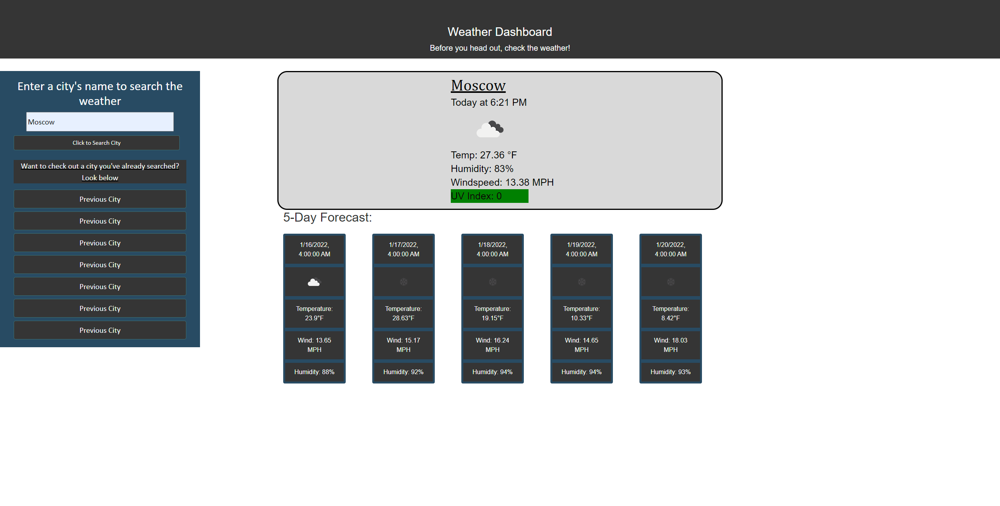

# HW6-Weather-Dashboard

For this project, I created a website that displays weather conditions for a city. When a user searches a city through the site, they are presented with information on the current weather conditions and a five-day forecast for the searched city. For this site, I used a mix of HTML, CSS, JavaScript, Bootstrap, and the Open Weather Service API. 

#Purpose
This project gave me experience with using JavaScript, HTML, CSS, BootStrap, and Server APIs to create a functioning application.

#Usage
To view my project (and search a city's weather conditions) simply click the attached link and you'll be able to see the deployed project.
https://fvjr.github.io/HW6---Weather-Dashboard/

Link:(https://github.com/fvjr/HW5-Daily-Planner/settings/pages/source)

Also, here's my code for the project in my Git repository:
https://github.com/fvjr/HW6---Weather-Dashboard

#Contributing 
To access the code, access my GitHub repo titled "HW6---Weather-Dashboard". My GitHub repo is linked above. If you have any ideas of how to simplify or improve some code, please feel free to reach out! I'll continue to improve the project as I have time to work on it.

#Credits 
Assistance provided by Penn LPS Coding Boot Camp/Trilogy Education Services.

#Resources
1.) https://getbootstrap.com/docs/5.1/getting-started/introduction/
2.) https://momentjs.com/
3.) https://www.w3schools.com/js/default.asp
4.) https://developer.mozilla.org/en-US/docs/Web/JavaScript
5.) https://coderrocketfuel.com/
6.) https://icons8.com/ (icons)
